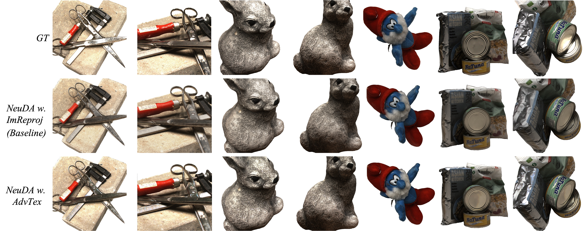

# NeuDA

### [Project Page](https://3d-front-future.github.io/neuda) | [Paper](https://arxiv.org/pdf/2303.02375.pdf) | [Data](https://drive.google.com/file/d/1dQWsKbSs4BhLUWB1BxrOWORJzoLAcYwh)

### Official Pytorch implemntation of the paper "NeuDA: Neural Deformable Anchor for High-Fidelity Implicit Surface Reconstruction", accepted to CVPR 2023.

---

We presents **Deformable Anchors** representation approach and a simple **hierarchical position encoding** strategy. The former maintains learnable anchor points at verities to enhance the capability of neural implicit model in handling complicated geometric structures, and the latter explores complementaries of high-frequency and low-frequency geometry properties in the multi-level anchor grid structure.

https://github.com/3D-FRONT-FUTURE/NeuDA/assets/5526396/3a25e3eb-ea57-4831-bbbb-3280addb2ddb

This repository implements the training / evaluation pipeline of our paper and provide a script to generate a textured mesh. Besides, based on reconstructed surface by NeuDA, we further adopt an **adversarial texture optimization** method to recover fine-detail texture.



## Install
### NeuDA - Surface Reconstruction
Clone this repository, and install environment.
```shell
$ git clone https://github.com/3D-FRONT-FUTURE/NeuDA.git
$ cd NeuDA
$ pip install -r requirements.txt
```

### [Optional] Adversarial Texture Optimization 
For adversarial texture optimization, you need to install [Blender-3.4](https://www.blender.org/download/) that will be used to generate initial UVMap and texture. And make sure that `blender-3.4` has been correctly set in your environment variables.

Compile the cuda rendering and cpp libraries.

```shell
$ sudo apt-get install libglm-dev libopencv-dev

$ cd NeuDA/models/texture/Rasterizer
$ ./compile.sh

$ cd ../CudaRender
$ ./compile.sh
```

## Dataset 
### Public dataset
* **DTU**: [data_DTU.zip](https://drive.google.com/drive/folders/1Nlzejs4mfPuJYORLbDEUDWlc9IZIbU0C) for training, [DTU Point Clouds](http://roboimagedata.compute.dtu.dk/?page_id=36) for evaluation.

### Custom data
#### Train NeuDA with your custom data:
1. Please install [COLMAP](https://colmap.github.io/).
2. Following 1st step **General step-by-step usage** to recover camera poses in [LLFF](https://github.com/Fyusion/LLFF).
3. Using script `tools/preprocess_llff.py` to generate `cameras_sphere.npz`.

The data should be organized as follows:
```
<case_name>
|-- cameras_sphere.npz  # camera parameters
|-- image
    |-- 000.png         # target image for each view
    |-- 001.png
    ...
|-- mask
    |-- 000.png         # target mask each view (For unmasked setting, set all pixels as 255)
    |-- 001.png
    ...
|-- sparse
    |-- points3D.bin    # sparse point clouds
    ...
|-- poses_bounds.npy    # camera extrinsic & intrinsic params, details seen in LLFF
```

Here the `cameras_sphere.npz` follows the data format in [IDR](https://github.com/lioryariv/idr/blob/main/DATA_CONVENTION.md), where `world_mat_xx` denotes the world to image projection matrix, and `scale_mat_xx` denotes the normalization matrix.


## Run

* Training and evaluation with mask
```shell
$ ./traineval.sh $case_name $conf $gpu_id
```
For examples, `./traineval.sh dtu_scan24 ./conf/neuda_wmask.conf 1`

* Training and evaluation without mask
```shell
$ ./traineval.sh $case_name $conf $gpu_id
```
For examples, `./traineval.sh dtu_scan24 ./conf/neuda_womask.conf 1`

The corresponding log can be found in `exp/<case_name>/<exp_name>/`.

* Evaluation with [pretrained models](https://drive.google.com/file/d/1dQWsKbSs4BhLUWB1BxrOWORJzoLAcYwh).
```shell
$ python extract_mesh.py --case $case --conf $conf --eval_metric
```
For examples, `python extract_mesh.py --case dtu_scan24 --conf ./conf/neuda_womask.conf --eval_metric`


* **[Optional]** Given the reconstructed surface by NeuDA, training with adversarial texture optimization:
```shell
$ ./texture_opt.sh $case_name $conf $gpu_id [$in_mesh_path] [$out_mesh_path]
```
For examples, `./texture_opt.sh dtu_scan24 ./conf/texture_opt.conf 1`


## Citation
If you find the code useful for your research, please cite our paper.
```
@inproceedings{cai2023neuda,
  title={NeuDA: Neural Deformable Anchor for High-Fidelity Implicit Surface Reconstruction},
  author={Cai, Bowen and Huang, Jinchi and Jia, Rongfei and Lv, Chengfei and Fu, Huan},
  booktitle={Proceedings of the IEEE Conference on Computer Vision and Pattern Recognition},
  year={2023}
}
```

## Acknowledgement
Our code is heavily based on [NeuS](https://github.com/Totoro97/NeuS). Some of the evaluation and cuda rendering code is borrowed from [NeuralWarp](https://github.com/fdarmon/NeuralWarp) and [AdversarialTexture](https://github.com/hjwdzh/AdversarialTexture) with respectively. Thanks to the authors for their great work. Please check out their papers for more details.
